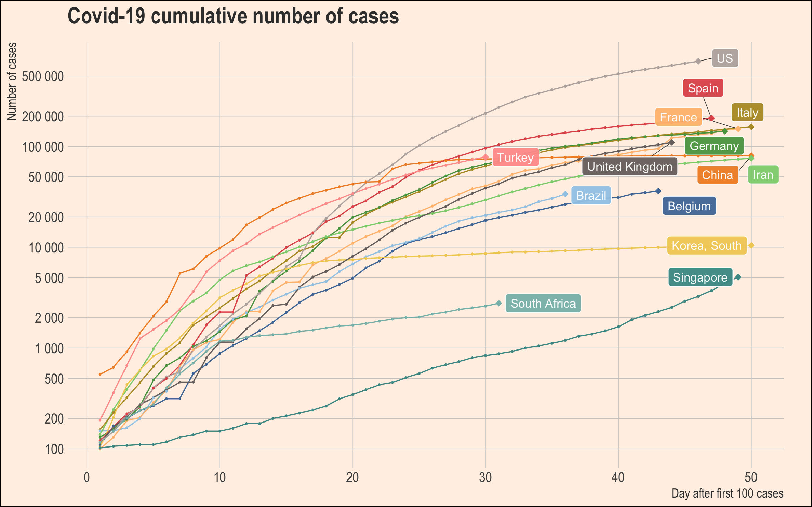

# Data Visualization
#### Part of IHI Code Club Workshop Series

|                      |                                                                                                         |
|----------------------|---------------------------------------------------------------------------------------------------------|
| Topic                | Data visualization                                                                                      |
| Objectives           | Learn data visualization with `ggplot2` and basic data wrangling with `tidyverse`                       |
| Dataset              | The [John Hopkins CSSE Covid-19 dataset](https://github.com/CSSEGISandData/COVID-19).                   |
| Language             | R                                                                                                       |
| Libraries [OPTIONAL] | `tidyverse_1.3.0`, `lubridate_1.7.4`, `[ggthemes_4.2.0]`, `[ggrepel_0.8.0.9000]`, `[hrbrthemes_0.6.0]`  |
| Level                | Beginner to Intermediate                                                                                |
| Pre-requisites       | Basic familiarity with `R`, `RStudio`, and `RMarkdown`                                                  |

### Structure
We will do a live, interactive coding workshop to learn how to create the following plot:

Instructions are provided in `workspace/data-vis.Rmd` (Rmarkdown file)
and `workspace/data-vis.html` (pre-rendered HTML file - download the raw and open in a web browser to see)

### Launch Binder

Please click the following button if you like to use a web version of JupyterLab or RStudio with dependencies installed via [Binder](https://mybinder.readthedocs.io/en/latest/index.html)

---

### Some useful R packages for data visualization
* [gganimate](https://gganimate.com/) - Make animation with ggplot2
* Themes:
    * [ggthemes](https://github.com/jrnold/ggthemes)
    * [hrbrthemes](https://github.com/hrbrmstr/hrbrthemes)
    * [ggthemr](https://github.com/cttobin/ggthemr)
* [ggrepel](https://github.com/slowkow/ggrepel) - Avoid text / label overlapping in ggplot2
* Interactive graph: [ggiraph](https://github.com/davidgohel/ggiraph), [plotly](https://plotly.com/r/)
* Combining ggplot: [cowplot](https://wilkelab.org/cowplot/index.html), [patchwork](https://patchwork.data-imaginist.com/index.html)
* Utilitis:
    * [extrafont](https://cran.r-project.org/web/packages/extrafont/index.html) - use custom font
    * [RColorBrewer](https://cran.r-project.org/web/packages/RColorBrewer/index.html) - select color based on [colorbrewer2](https://colorbrewer2.org/) pallete
* Lower-level engine:
    * [grid graphic](https://stat.ethz.ch/R-manual/R-devel/library/grid/doc/grid.pdf) - low-level system for plotting in R
    * [gtable](https://gtable.r-lib.org/) - layout engine for `ggplot2`, built on top of `grid` graphic system

_Special mention_: [ggplot2 extension gallery](https://exts.ggplot2.tidyverse.org/gallery/) - A collection of popular ggplot2 extension

### References
#### Data visualization
* A collection of data visualization books on [Information is Beautiful](https://informationisbeautiful.net/visualizations/dataviz-books/)
* Data visualization gallery:
    * [Data Viz Project](https://datavizproject.com/)
    * [R graph gallery](https://www.r-graph-gallery.com/)
* [Flowing Data](https://flowingdata.com/)
* [WTF Viz](https://viz.wtf/) - How NOT to visualize
* [Visualization of Biomedical Data](https://www.annualreviews.org/doi/full/10.1146/annurev-biodatasci-080917-013424) - O'Donoghue SI et al. 2018
* Visualization Analysis and Design book by Tamara Munzer (view on [Amazon](https://www.amazon.co.uk/Visualization-Analysis-Design-AK-Peters/dp/1466508914/ref=sr_1_1))

#### ggplot2
* [ggplot2: Elegant Graphics for Data Analysis](https://ggplot2-book.org/index.html) by Hadley Wickham
* [Fundamentals of Data Visualization](https://serialmentor.com/dataviz/) by Claus O. Wilke
* [Interactive web-based data visualization with R, plotly, and shiny](https://plotly-r.com/index.html) by Carson Sievert

#### Other data visualization softwares
* [Tableau](http://tableau.com/)
* JavaScript:
    * [D3.js](https://d3js.org/) - a JavaScript library for manipulating documents based on data
    * [Vega](https://vega.github.io/vega/) / [Vega-Lite](https://vega.github.io/vega-lite/) -  a JavaScript library based on Grammar of Graphics
* Python-based:
    * [Seaborn](https://seaborn.pydata.org/)
    * [Matplotlib](https://matplotlib.org/)
    * [Bokeh](https://bokeh.org/)

### Utilities
* [Adobe Color](https://color.adobe.com/)
